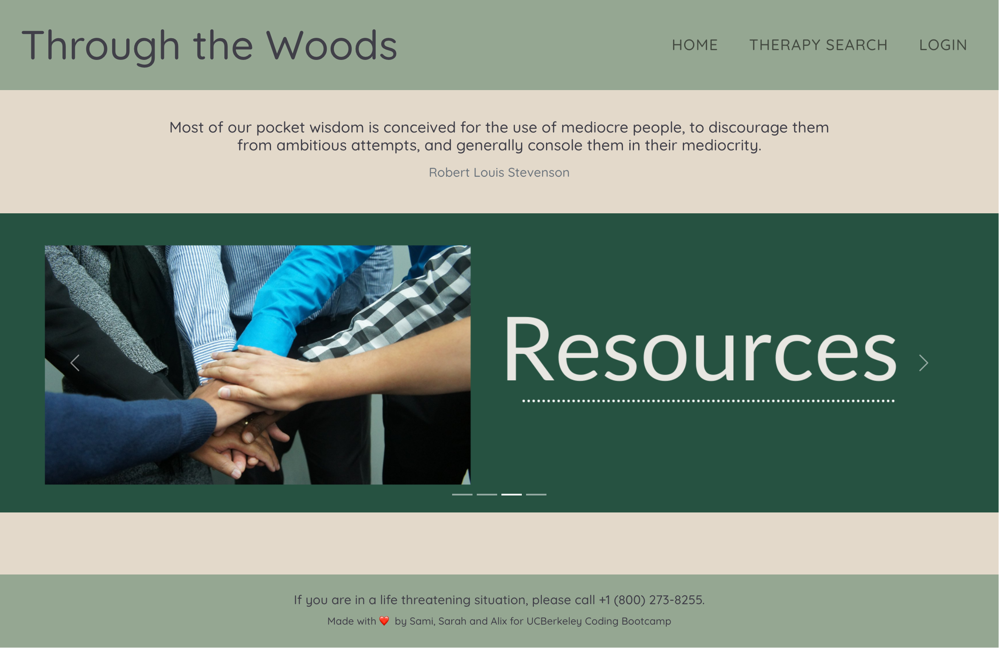
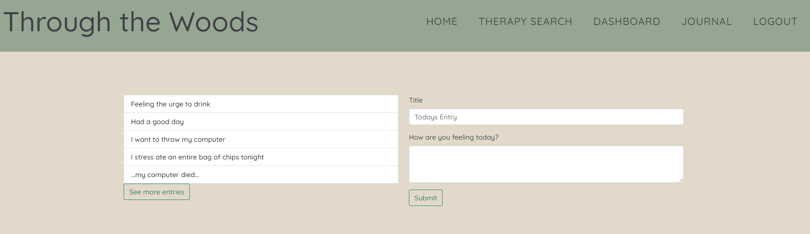
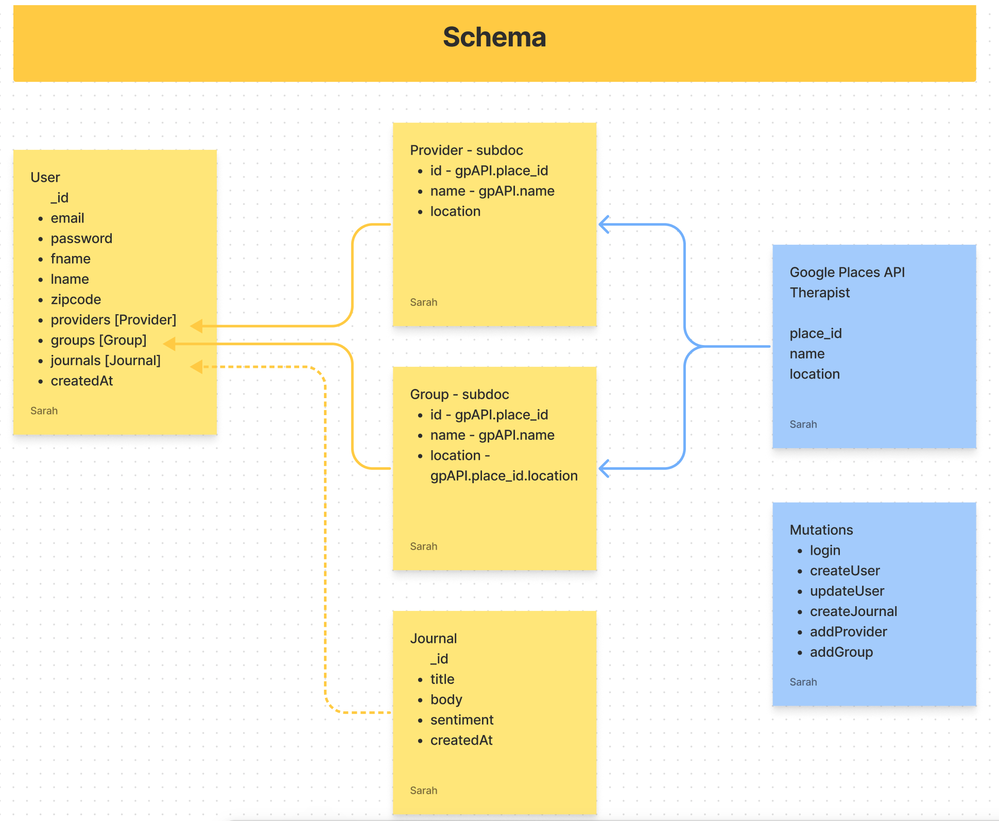

# Through the Woods: Move Forward to a Healthier You
Therapy and finding resources can feel like an uncomfortable or inaccessible thing for people. Requires a lot of disparate overhead to manage. This application is meant to simplify that, so the user can focus on growth instead of managing the operational overhead.

This is a mobile-first web application built with React and leverage a MongoDB, Mongoose, and GraphQL serverside implementation. 

<!-- TABLE OF CONTENTS -->

  
Table of Contents

  <ol>
    <li>
      <a href="#summary">Summary</a>
    </li>
    <li>
      <a href="#installation">Installation</a>
    </li>
    <li>
      <a href="#future-development">Future Development</a>
    </li>
    <li>
      <a href="#license">License</a>
    </li>
    <li>
      <a href="#collaborators">Collaborators</a>
    </li>
    <li>
      <a href="#references">References</a>
    </li>
  </ol>

## Summary

[Visit the the deployed Through the Woods aplication.](https://through-the-woods.herokuapp.com/)

[Powerpoint walkthrough of app functionality and development - 5min read.](https://docs.google.com/presentation/d/19W21rhjeJunoZX9KjJ6iXCpqs9AD1KfcSacy-EF1Hu0/edit?usp=sharing)

### Functionality
* User account creation and authentication to secure account-specific data:
  * User Journals
  * Therapy/Resource Groups
  * User Profile Details
  * Session key stored locally
* Mutable search for Therapists, Support Groups, and Rehab Centers
  * Providers contact information for local Therapists, Support Groups, and Rehab Centers. 
  * Entitiy is defineable by user, as is location radius
  * Any result can be saved to user profile.
* Mobile-responsive, mobile first design leveraging React-Bootstrap.
* Diaries for users to record how they're feeling to track progression and development over time. 

### Home

### Journal View and Creation

### Login Mogdal

## Database Schema - MongoDB

## Installation
Ensure you have Node.js installed locally to install packages to and from the public npm registry. Node.js installation documentation.

1. Clone the repository to your local machine.

2. Install application dependencies `npm install`.
Required when when you first set up the project for local development or use OR if any changes are made to the project's dependencies. More Node information here.

3. Start the application with `npm run develop`. This will open the app in a new tab in your default web browser. 

<!-- Technologies -->
## Built With
* [Mongo DB](https://www.mongodb.com/) - The NoSQL database used to support record storage.
* [React](https://reactjs.org/) - Javascript library used to generate all user interfaces.
* [Axios](https://axios-http.com/) - Promise based HTTP client for the browser and node.js.
* [JSX](https://reactjs.org/docs/introducing-jsx.html) - Javascript syntax extension for generating React elements in the DOM.
* [Node](https://nodejs.org/en/) - Asynchronous event-driven JavaScript runtime environment that executes JavaScript code outside a web browser.
* [NPM](https://www.npmjs.com/) - Node package manager, used in conjunction with JS and Inquirer to support application logic and Command Line interface.
  * [GraphQL](https://www.npmjs.com/package/graphql) - JavaScript reference implementation for GraphQL, a query language for APIs.
  * [@Apollo-client](https://www.npmjs.com/package/@apollo/client) - Enables UI components that fetch data via GraphQL.
  * [Apollo-server-express](https://www.npmjs.com/package/apollo-server-express) - Express integration of Apollo Server, an open-source GraphQL server that works with many Node.js HTTP server frameworks.
  * [Mongoose](https://www.npmjs.com/package/mongoose) - Mongoose is a MongoDB object modeling tool used for all models in this application.
  * [jsonwebtoken](https://www.npmjs.com/package/jsonwebtoken) - Supports authorization and information exchange, allowing clients to preserve their session information after logging in. Supports for storing the session information locally and passing it to the server for authentication when making requests.
  * [Expressjs](https://expressjs.com/) - Leveraged for API's, utility methods, and middleware.
  * [Bcrypt](https://www.npmjs.com/package/bcrypt) - Used for password hashing.
  * [React-Bootstrap](https://react-bootstrap.github.io/getting-started/introduction/) - Bootstrap CSS framework for React projects.
* [CSS](https://devdocs.io/css/) - Custom application styling.
* [Javascript](https://developer.mozilla.org/en-US/docs/Web/javascript) - Core app logic.
* [HTML](https://developer.mozilla.org/en-US/docs/Web/HTML) - Used to create elements on the DOM.

* [Google Places API](https://developers.google.com/maps/documentation/places/web-service/overview) - Data for search engine

## Future Development
* Integrate Calendar UX with ToastUI to further consolidate operational overhead into the app and enhance value add for user.
* Expand customization for user
  * Edit account details
  * Ability to add notes to existing Journal entries
  * Journal export, Journal share via email.
* Expand Search capabilites to allow for media material Search
  * Including support of save to user
* Calendar (Toast UI) integration to consolidate therapy ops in app for given user
* Ability to share entries with your provider (access controls implementation)
* Enhance movitvation
  * Regular User Spotlight feature added to homepage
  * Milestone markers to acknowledge user's active work. Days since account creation, Meetings attended , Journaling consistency, etc
* Support Therapist user (access controls)
  * Messaging UX to allow secure conversations between a Provider and a User
  * Ability to access user Journals if permission granted by user.
* Add unit testing

## License
* Licensed under the [MIT](https://opensource.org/licenses/MIT) license. See `LICENSE` for more information.

## Collaborators
|**Sami Khawja** | **Alix Friedman** | **Sarah Hollingsworth** |
|-----------------|---------------|------------------|
| - [Portfolio](https://samikhawja.github.io/portfolio_page/)| - [Portfolio](https://alix1713.github.io/Alix/)| - [Portfolio](https://sahhollingsworth.github.io/portfolio-react/) |
| - [Github](https://github.com/samikhawja)| - [Github](https://github.com/Alix1713) | - [Github](https://github.com/sahhollingsworth) |
| - [LinkedIn](https://www.linkedin.com/in/samikhawja/)| - [LinkedIn](https://www.linkedin.com/in/alix1713/) | - [LinkedIn](https://www.linkedin.com/in/sarahhollingsworth/)|

## Helpful References
* [Stack Overflow discussion](https://stackoverflow.com/questions/5963669/whats-the-difference-between-event-stoppropagation-and-event-preventdefault) on the difference between event.stopPropagation() vs event.PreventDefault()
* React-Boostrap documentation on [Form validation](https://react-bootstrap.netlify.app/components/forms/#forms-validation) and [Alerts](https://getbootstrap.com/docs/4.0/components/alerts/)